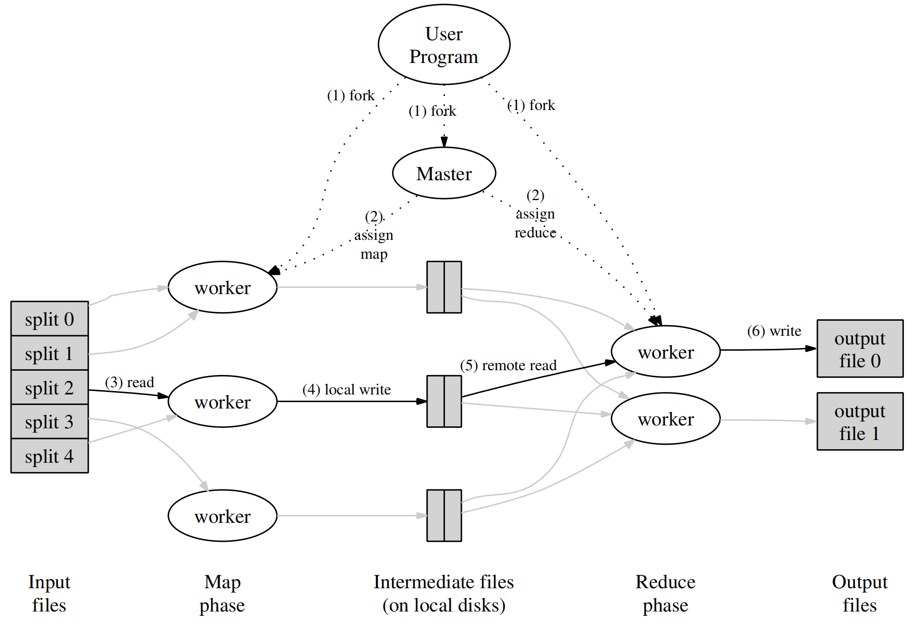
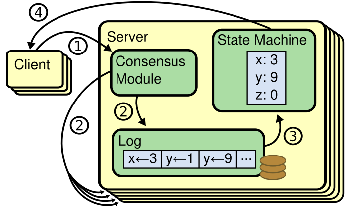
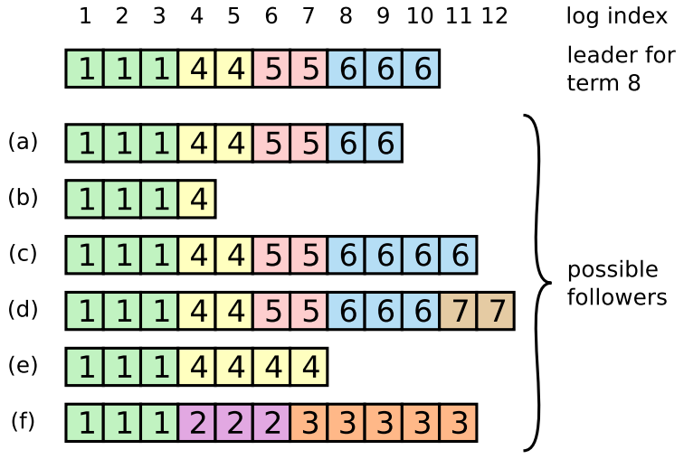
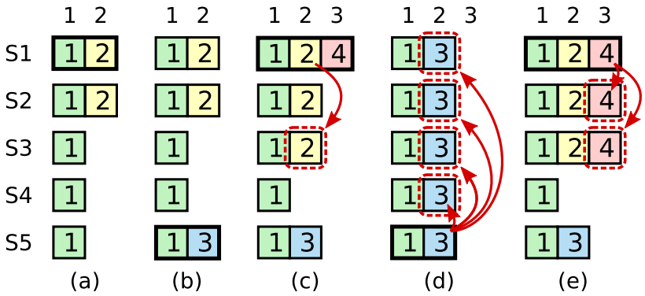

# 1. MapReduce
## Paper notes
### Programming model
Map接收key/value，通常key是文件名，value是文件内容，对value处理后产生大量key/value，称为中间key/value；Reduce接收中间key/value，对相同key的所有value进行处理，产生结果key/value。
### Implementation

#### 执行过程
1. 用户将输入数据划分为M片；
2. Master分派M个任务给workers，一个worker上可能有多个任务；
3. 每个map任务对自己的分片进行map操作，产生中间key/value；
4. 每个map任务将中间key/value进行分桶，分为R桶，通常采用哈希操作，由于所有任务采用相同哈希函数，因此不同任务产生的相同编号的桶中的内容通常是相同或相近的；
5. 每个reduce任务从所有map任务的存储中查询自己对应编号的桶，然后对所有桶一起进行排序；
6. 之后可以对排好序的key/value顺序进行reduce操作，将输出key/value写入存储。
#### 容错
worker容错：master周期性ping所有workers，如果无响应，对于已经完成map任务的，把该任务交给其他worker重做，对于正在执行的map或reduce任务，也重做。已经完成map任务需要重做是因为map得到的中间key/value存在本机上，无响应则无法获取，而已经完成的reduce任务无需重做是因为reduce得到的结果存在全局共享的文件系统内。

master容错：master设置周期性的checkpoint，出错后更换master从checkpoint继续。但是master仅有一个节点，出错的概率非常小，所以谷歌并没有实现master的容错。
#### 局部性
由于不同文件存储在不同机器上，可以指定存储待执行文件的机器去执行map操作，从而减少延迟。
#### 任务粒度
M和R一般比机器数量要大，从而实现负载均衡，并且在节点失效后可以加速恢复：把不同的任务分配给其他不同的节点。
#### 备份任务
为了避免单台机器执行过慢形成短板，当MapReduce快结束时，master将仍在执行的任务分配给其他空闲机器，任何一台机器执行完任务，该任务就被认为执行结束。
## 代码实现
### 优点总结
#### 容错（可用性）如何体现？
在coordinator分配给worker任务之后，会在10秒后检查任务是否完成，如果未完成，将该任务标记为未完成从而待分配。
#### 负载均衡（性能）如何体现？
worker通过rpc向coordinator申请任务，实现了动态负载均衡；中间key/value通过哈希划分为大致均衡的桶，每个reduce worker执行所有map worker上的同一编号的桶，从而保证相对均衡的工作量。
#### 可扩展性（性能）如何体现？
通过改变map节点和reduce节点的数量，可以实现可扩展性。
#### （一致性）如何体现？
coordinator分配任何和通过rpc接收到任务完成消息时，需要先加锁，再对结构体进行操作。
### 改进空间
#### 任务粒度并不完美
每个执行map操作的worker处理一个输入文件，M和机器数量相等，粒度划分并不优秀。
#### 分布式执行会带来新的问题
map任务产生的中间文件都保存在本地，reduce也从本地根据文件名规则读文件，但如果分布式执行，一个map节点挂掉后，coordinator必须通知所有reduce节点新的map在哪里执行，从而保证reduce节点能读到正确的中间文件。
# 2. GFS
### What are the steps when client C wants to read a file?
1. C sends filename and offset to coordinator (CO) (if not cached) 

    CO has a filename -> array-of-chunkhandle table

    and a chunkhandle -> list-of-chunkservers table
2. CO finds chunk handle for that offset
3. CO replies with chunkhandle + list of chunkservers
4. C caches handle + chunkserver list
5. C sends request to nearest chunkserver
   
   chunk handle, offset
6. chunk server reads from chunk file on disk, returns to client
### What are the steps when C wants to write a file at some offset?
1. C asks CO about file's chunk @ offset
2. CO tells C the primary and secondaries
3. C sends data to all (just temporary...),waits for all replies (?)
4. C asks P to write
5. P checks that lease hasn't expired
6. P writes its own chunk file (a Linux file)
7. P tells each secondary to write (copytemporary into chunk file)
8. P waits for all secondaries to reply, or timeout
   
   secondary can reply "error" e.g. out of disk space
9. P tells C "ok" or "error"
10. C retries from start if error
### Pros
#### 可扩展性（性能）与负载均衡（性能）
将naming（coordinator）与storage（chunkserver）分开，chunkserver节点数量可以增加，从而实现可扩展性，当多个clients向多个chunkserver请求访问时，总体throughput得到极大提升。

coordinator节点管理文件chunk划分，由于该节点只有一个，掌握全局信息，所以可以智慧地实现负载均衡。
#### 容错（可用性）
每个chunk保存在三个chunkserver上，一个primary，两个secondary。

primary由coordinator指定，通过lease方式，指定某个副本为primary的时间为60秒，使用lease是非常聪明的选择，因为如果不采用lease，primary挂掉，coordinator无法分辨究竟是primary挂掉了还是网络延迟了，如果此时coordinator指定另一个副本为primary，那么就可能存在两个primary，如果不指定新的primary，可能真的挂掉了，所以采用了lease以后，每到60秒，原先的primary如果没有挂掉，也会自动放弃primary身份，coordinator可以指定新的primary。

如果secondary挂掉，coordinator指定新的chunkserver存储chunk副本。
#### （一致性）
读文件，可以从primary或secondary读，写文件，只能从primary写，然后primary对secondary进行同步。
### Cons
#### 单个coordinator
单个coordinator可能会因为CPU、内存资源耗尽等问题而挂掉，造成严重的单点故障；即便没有挂掉，单个coordinator也可能称为性能瓶颈。
#### 小文件不友好
chunk大小是64MB，因此chunkserver存储小文件时并不高效。
#### 缺少fail-over
当primary挂掉，coordinator需要等到lease到期才会指定新的primary，所以效率较低。
#### 一致性过弱
GFS采用的是弱一致性，也许太弱了~
# 3 Raft
## Paper notes
### Replicated state machines

Replicated state machines are used to solve a variety of fault tolerance problems in distributed systems.

Replicated state machines are typically implemented using a replicated log. Each log contains the same commands in the same order, so each state machine processes the same sequence of commands.

Keeping the replicated log consistent is the job of the consensus algorithm.
### Designing for understandability
The first technique is the well-known approach of problem decomposition: where ever possible, we divided problems into separate pieces that could be solved, explained, and understood relatively independently. For example, in Raft we separated leader election, log replication, safety, and membership changes.

Our second approach was to simplify the state space by reducing the number of states to consider, making the system more coherent and eliminating nondeterminism where possible.
### The Raft consensus algorithm
#### Leader election
当服务器启动时，它是follower，如果在它的election timeout内没有收到来自leader的heartbeat消息，那么它就认为没有leader，发起新一轮选举；它把自己的term加1，转变为candidate，给自己投一票，向所有server发送RequestVote rpc请求，此时有以下三种情况：

第一种，大多数server投赞成票，它成为leader，它向所有server发送heartbeat消息来树立权威并且阻止新的选举；

第二种，等待投票过程中，它收到了来自leader的AppendEntries rpc消息，如果leader的term至少和它一样大，它就放弃选举回到follower，否则，它就拒绝来自leader的rpc消息，继续当candidate；

第三种，除了它以外还有别的candidate在参加选举，最后大家的票数都一样，这种情况下，所有candidate都time out，并且都再发起新一轮选举，把自己term加1，给自己投一票，向其他server发送RequestVote rpc消息。但是这样会无穷尽的循环下去，怎么解决呢？Raft这样解决：给每一个candidate随机的选举timeout，这样在大多数情况下只有一个server会time out，它在其他server time out之前就赢得了选举；同样的机制也用在票数相等情况上，如果票数相等了，每个candidate等待一个随机的timeout之后再发起新的选举。
#### Log replication
client向leader发起request，leader把它作为新的entry添加到自己的log里，然后向所有server发送AppendEntries rpc消息，如果某个follower崩了、运行缓慢或者网络有问题，leader就不停地发rpc消息直到所有follower存储了这个log entry。

每个log entry存储了生成entry时的term号以及包含的命令，此外也有在log里的index。如果这个log entry在大多数机器上成功复制，那么leader就commit这个entry，所谓的commit，就是把entry包含的命令应用于状态机。如果一个follower得知这个entry被leader commit了，它也把这个entry commit。如果一个entry被commit了，Raft会保证它永远不会被撤销，并且最终会在所有能运行的server里都commit。

但是，follower可能会缺失一些entry，也可能会多出一些leader没有的entry，或者两种都存在，如下图所示：

f在term 2当leader的时候挂了，term 2的entry没有复制出去，很快它又好了，继续当term 3的leader，然后又挂了，再也没好过；然后e当了term 4的leader，在index 5时，b挂了，term 4的第二个entry被成功复制到了大多数server，所以被commit了，然后到了index 6，e的网络出了问题，别的server没收到它的消息，所以选出了新的leader，谁是term 5的leader貌似看不出来；但是能看出term 6的leader是c，到了index 10，a挂了，所以term 6的第三个entry并没有被commit；到了index 11，显然c的网络也出了问题，d成为了新的leader。

所以Raft如何处理这种entry不一致的问题呢？leader对每一个follower都维护一个nextIndex，指的是leader发送给该follower的下一个log entry的index。当leader刚成为leader时，它对所有follower的nextIndex值都是它自己最新log entry的index+1。当它发送AppendEntries rpc时，如果follower的log和leader的不一致，rpc会被拒绝，leader就把对应的nextIndex-1，重新发送rpc，直到rpc被接受，此时follower该entry之后的所有entry都被删除，然后添加上与leader一致的entry。然后leader和follower的log就相一致了。
#### Safety
1. 选举限制：Raft可以通过一些限制保证选出来的leader一定具有所有被commit的entry。entry被commit的前提是什么呢？是它被复制到大多数的server上了。所以，candidate想要得到选票，它的log必须至少和大多数server的log一样的“新”。candidate发送RequestVote rpc时，包含candidate的log信息，收到rpc的server比较一下log的term和index，如果term更新，则投它，如果term一样，但是index更新，则也投它。
2. Raft不会根据entry复制到大多数server上来提交之前term的的entry，只会在当前term提交entry如果它被复制到大多数server上，因为为了避免以下情况：

#### Follower and candidate crashes
如果follower或candidate崩了，那么任何发往它的RequestVote和AppendEntries都会失败，并且会无限制地再次发送。如果一个sever收到rpc后做出动作，但是在准备回复之前崩了，也没关系，因为Raft的rpc都是幂等的，下次收到相同的rpc后不做动作就行了。
#### Timing and availability
Raft算法一个重要的要求安全不能依赖于timing，然而，系统的availability不可避免地依赖于timing。

broadcastTime << electionTimeout << MTBF