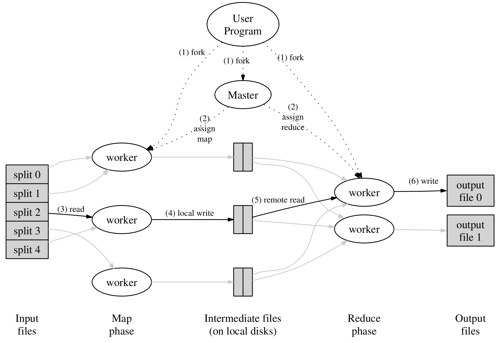

# 1. MapReduce
## Paper notes
### Programming Model
Map接收key/value，通常key是文件名，value是文件内容，对value处理后产生大量key/value，称为中间key/value；Reduce接收中间key/value，对相同key的所有value进行处理，产生结果key/value。
### Implementation

#### 执行过程
1. 用户将输入数据划分为M片；
2. Master分派M个任务给workers，一个worker上可能有多个任务；
3. 每个map任务对自己的分片进行map操作，产生中间key/value；
4. 每个map任务将中间key/value进行分片，分为R片，通常采用哈希操作，由于所有任务采用相同哈希函数，因此不同任务产生的相同编号的分片中的内容通常是相同或相近的；
5. 每个reduce任务从所有map任务的存储中查询自己对应编号的分片，然后对所有分片一起进行排序；
6. 之后可以对排好序的key/value顺序进行reduce操作，将输出key/value写入存储。
#### 容错
worker容错：master周期性ping所有workers，如果无响应，对于已经完成map任务的，把该任务交给其他worker重做，对于正在执行的map或reduce任务，也重做。已经完成map任务需要重做是因为map得到的中间key/value存在本机上，无响应则无法获取，而已经完成的reduce任务无需重做是因为reduce得到的结果存在全局共享的文件系统内。

master容错：master设置周期性的checkpoint，出错后更换master从checkpoint继续。但是master仅有一个节点，出错的概率非常小，所以谷歌并没有实现master的容错。
#### 局部性
由于不同文件存储在不同机器上，可以指定存储待执行文件的机器去执行map操作，从而减少延迟。
#### 任务粒度
M和R一般比机器数量要大，从而实现负载均衡，并且在节点失效后可以加速恢复：把不同的任务分配给其他不同的节点。
#### 备份任务
为了避免单台机器执行过慢形成短板，当MapReduce快结束时，master将仍在执行的任务分配给其他空闲机器，任何一台机器执行完任务，该任务就被认为执行结束。
## 代码实现
### 优点总结
#### 容错（可用性）如何体现？
在coordinator分配给worker任务之后，会在10秒后检查任务是否完成，如果未完成，将该任务标记为未完成从而待分配。
#### 负载均衡（性能）如何体现？
worker通过rpc向coordinator申请任务，实现了动态负载均衡；中间key/value通过哈希划分为大致均衡的分片，每个reduce worker执行所有map worker上的同一编号分片，从而保证相对均衡的工作量。
#### 可扩展性（性能）如何体现？
通过改变map节点和reduce节点的数量，可以实现可扩展性。
#### （一致性）如何体现？
coordinator分配任何和通过rpc接收到任务完成消息时，需要先加锁，再对结构体进行操作。
### 改进空间
#### 任务粒度并不完美
每个执行map操作的worker处理一个输入文件，M和机器数量相等，粒度划分并不优秀。
#### 分布式执行会带来新的问题
map任务产生的中间文件都保存在本地，reduce也从本地根据文件名规则读文件，但如果分布式执行，一个map节点挂掉后，coordinator必须通知所有reduce节点新的map在哪里执行，从而保证reduce节点能读到正确的中间文件。